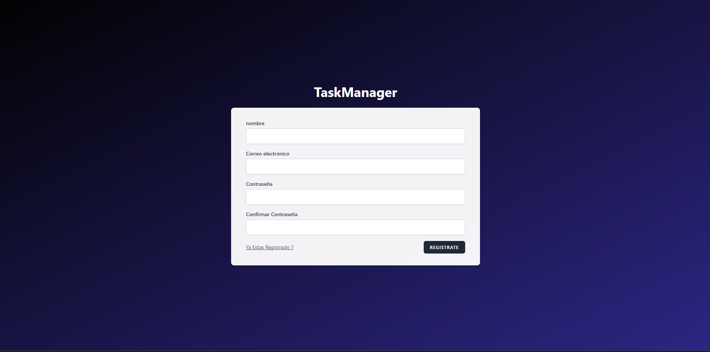
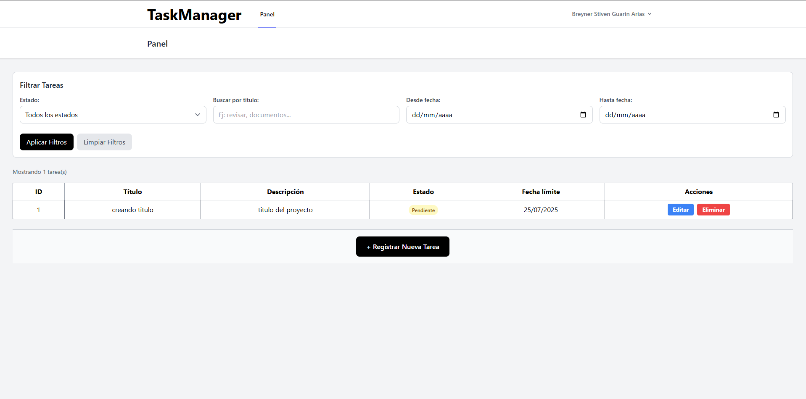
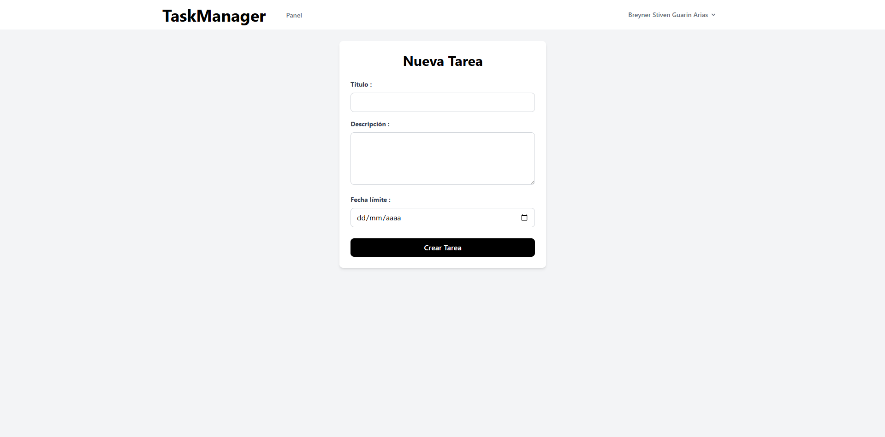
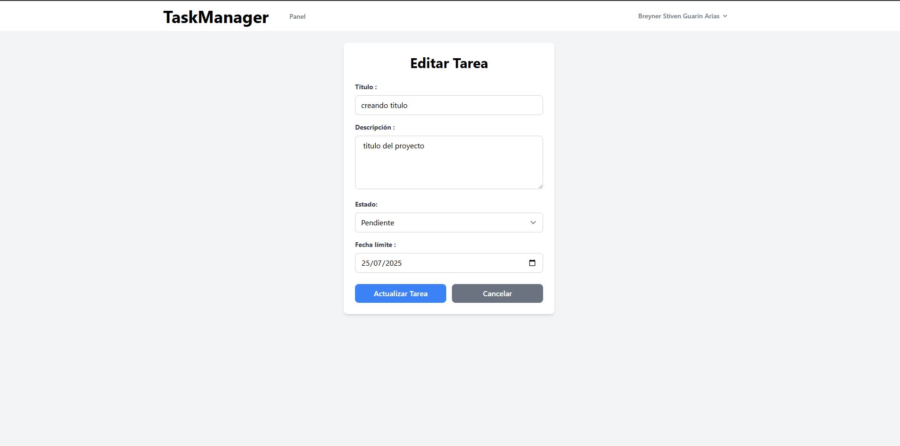

  

<h1 align="center">TaskManager</h1>

Aplicación web desarrollada en Laravel para la gestión personal de tareas.

---

## 🚀 Descripción

**TaskManager** es una aplicación web desarrollada como proyecto personal para demostrar habilidades en desarrollo full stack con Laravel.  
El sistema permite a los usuarios registrarse, iniciar sesión y gestionar sus tareas diarias de manera sencilla y eficiente, facilitando la organización y el seguimiento de pendientes.

El proyecto fue realizado con fines de aprendizaje

---

## 🛠️ Funcionalidades principales

- Registro y autenticación de usuarios
- Creación, edición y eliminación de tareas
- Visualización de tareas en un panel personal
- Interfaz moderna con Tailwind CSS

---

## 🧰 Tecnologías usadas

- **Laravel** (framework backend)
- **PHP**
- **MySQL** (base de datos, gestionada con XAMPP)
- **Tailwind CSS** (estilos)
- **Visual Studio Code** (editor de desarrollo)
- **XAMPP** (servidor local y gestor de base de datos)

---

## 📸 Capturas de pantalla

  

<b>Login:</b> pantalla de inicio de sesión.

  

<b>Registro:</b> formulario para crear una nueva cuenta.

  

<b>Dashboard:</b> panel principal donde se visualizan las tareas del usuario.

  

<b>Crear tarea:</b> formulario para agregar nuevas tareas.

  

<b>Editar tarea:</b> formulario para modificar tareas existentes.

---

## 👤 Autor

- [Breyner Stiven Guarin Arias](https://github.com/BreynerSti)

---
